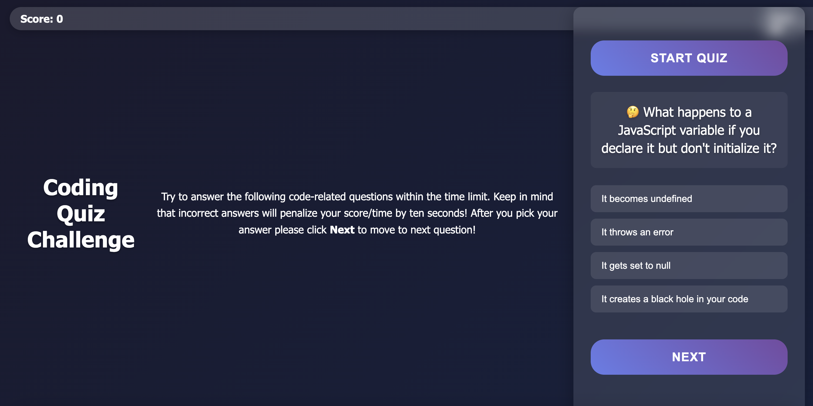

# JavaScript Code Quiz 🎯

### Link of deployed application: 
https://kazichaska.github.io/code-quiz/

### Description:
An interactive and engaging JavaScript quiz application that tests your web development knowledge with a mix of technical questions and programming humor. The quiz features:

- 🎲 Randomly shuffled questions each time you play
- ⏱️ Timed challenges with 75 seconds on the clock
- 📊 Dynamic scoring system (+10 for correct, -5 for incorrect answers)
- 🏆 High score tracking with local storage
- 🎨 Engaging UI with immediate feedback
- 😄 Fun, emoji-enhanced questions covering JavaScript, CSS, and web development

Perfect for:
- Web developers testing their knowledge
- Students learning JavaScript fundamentals
- Anyone who enjoys coding challenges with a touch of humorcript Code Quiz

### Link of deployed application: 
https://kazichaska.github.io/code-quiz/

### Description:
    Build a timed coding quiz with multiple-choice questions. This app will run in the browser, and will feature dynamically updated HTML and CSS powered by JavaScript code that you write. It will have a clean, polished, and responsive user interface. This week’s coursework will teach you all the skills you need to succeed in this assignment.


### User Story

    ```
    AS A coding boot camp student
    I WANT to take a timed quiz on JavaScript fundamentals that stores high scores
    SO THAT I can gauge my progress compared to my peers
    ```

### Acceptance Criteria

    ```
    GIVEN I am taking a code quiz
    WHEN I click the start button
    THEN a timer starts and I am presented with a question
    WHEN I answer a question
    THEN I am presented with another question
    WHEN I answer a question incorrectly
    THEN time is subtracted from the clock
    WHEN all questions are answered or the timer reaches 0
    THEN the game is over
    WHEN the game is over
    THEN I can save my initials and score
    ```

### Features in Detail

1. **Question Pool**
   - 10 diverse questions covering JavaScript concepts
   - Each question features emoji icons for visual engagement
   - Mix of technical questions and programming jokes

2. **Scoring System**
   - +10 points for each correct answer
   - -5 points for incorrect answers
   - Time penalty of 5 seconds for wrong answers

3. **High Score System**
   - Persistent storage of scores
   - Displays player initials, score, and date
   - Sortable high score list
   - Quick access to highest score

4. **User Interface**
   - Clean, modern design
   - Immediate visual feedback for answers
   - Progress tracking through questions
   - Responsive layout for all devices

### How to Play
1. Click "Start" to begin the quiz
2. Answer each question within the time limit
3. Watch your score grow with correct answers
4. Enter your initials when finished
5. Compare your score with others on the leaderboard

### Screenshots

*The welcoming start screen of the quiz*


*Interactive question interface with immediate feedback*

### Technical Implementation

The application is built using:
- HTML5 for structure
- CSS3 for styling and animations
- Vanilla JavaScript for functionality
- Local Storage API for score persistence

### Future Enhancements
- Additional question categories
- Difficulty levels
- Sound effects
- Social sharing features
- More detailed statistics tracking